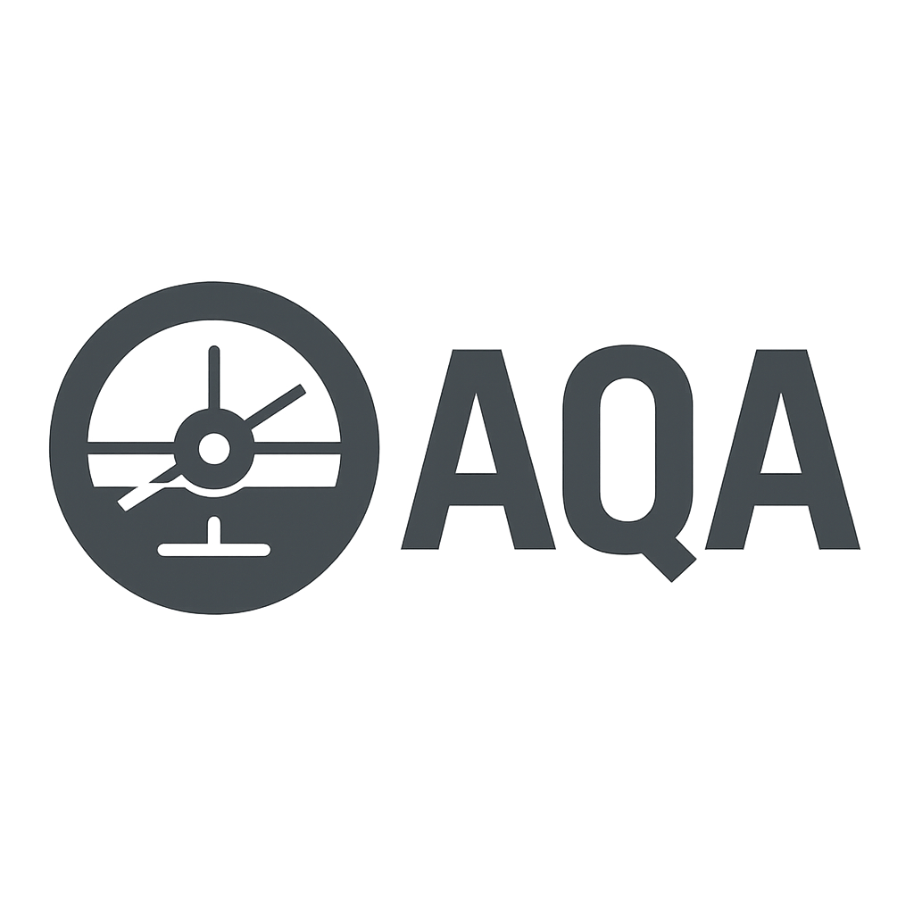

  

# AQA — Autonomous Query Assistant

AQA is a cockpit-integrated voice intelligence system designed to operate as an autonomous assistant. Unlike chatbots or generic AI agents, AQA is mission-oriented, embedded, and focused on situational awareness.

## 🧭 Core Idea

AQA is not just another AI voice bot. It is a **voice-native system module** intended to live inside aircraft cockpits — assisting pilots with short, purposeful voice interactions.

## 💡 Key Features

- **Situational awareness**: monitors system and environment parameters
- **Voice commands**: understands key phrases, reacts accordingly
- **Alerting**: warns when flight conditions deviate from expected parameters
- **Checklists & flows**: acts as a verbal co-pilot
- **System integration**: links with navigation, sensors, mission logic
- **Adaptive output**: speaks with priority and brevity, not chatter

## 📦 Form Factors

- ESP32-based voice modules (offline)
- Smartphone-based assistants
- Fully integrated avionics software
- Modular plugins for experimental cockpits

## 🔧 Philosophy

Minimalist, focused, offline-first. AQA is designed to be dependable and present, not fancy. It’s a **crew member**, not a gadget.

## 🔄 Roadmap (excerpt)

- Phase 1: Offline local prototype with TTS/STT
- Phase 2: Flight data input (GPS, sensors)
- Phase 3: In-flight voice interaction
- Phase 4: Autonomy + checklists + safety logic
- Phase 5: Open SDK for aircraft builders

## 📜 License & IP

Project licensed under MIT. All published material is prior art. Open to expansion.

---

AQA is not an assistant. It is your voice-based flight co-pilot.
